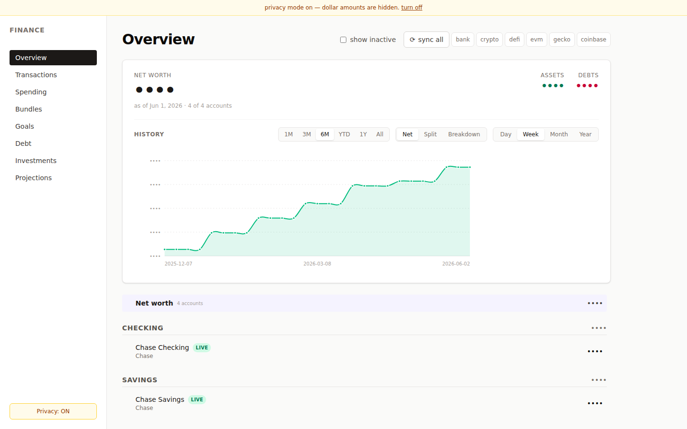
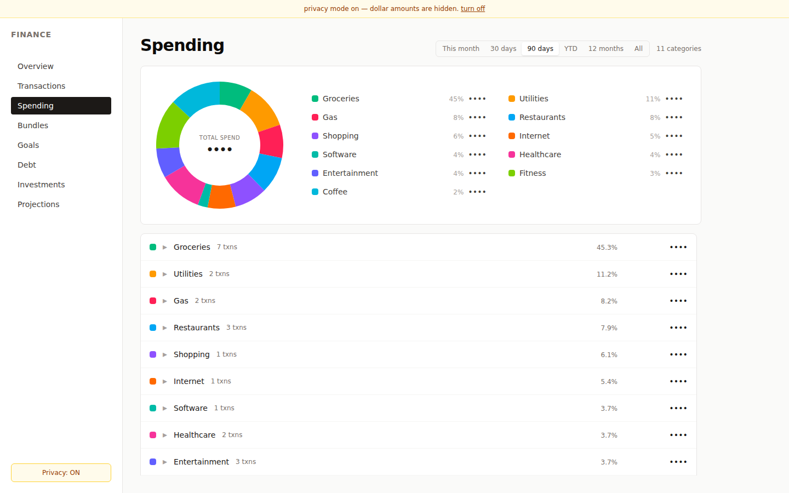
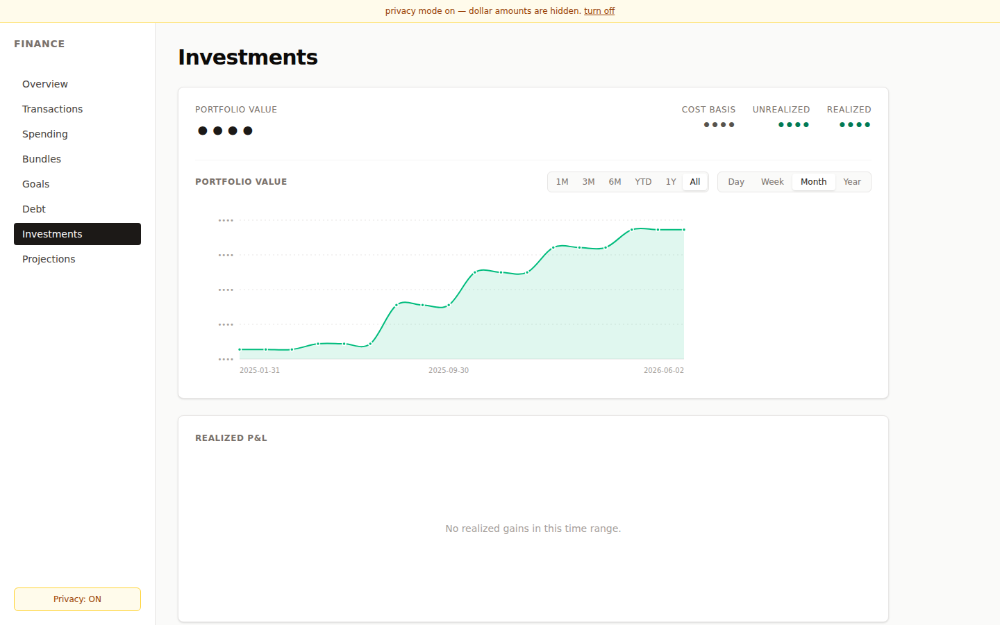

# Coffer

A self-hosted personal finance dashboard. 

Syncs all financial data into a local database using an industry standard double-entry ledger.
Configurable Providers include: SimpleFIN, Coinbase, Zerion, Alchemy, DefiLlama & GeckoTerminal

## Features

- **Double-entry ledger** — every dollar accounted for across all accounts
- **Multi-source sync** — SimpleFIN (banks), Zerion/Alchemy (crypto wallets),
  Coinbase (exchange), DefiLlama/GeckoTerminal (prices)
- **Net worth tracking** — daily time series with drill-down by account
- **Spending breakdown** — rule-based categorization, with optional [receipt itemization](docs/email.md) (pluggable email + LLM backends)
- **Investment tracking** — holdings, cost basis, realized P&L
- **Privacy mode** — blur all amounts for screen sharing

## Screenshots





## Prerequisites

- [Bun](https://bun.sh) v1.3+
- SQLite3
- Python 3.12+ (optional — needed for the categorization + reconciliation
  sidecar and the file-based parsers in `pipeline/`)

## Quick Start

```bash
git clone https://github.com/j-paterson/coffer.git
cd coffer
bun install

# Optional — only needed if you'll connect a sync provider. You can skip
# this entirely and add providers later in-app from the Settings page.
cp finance.config.ts.example finance.config.ts
cp .env.example .env
chmod 600 .env   # restrict .env to your user so stored API keys stay private

# Start the dashboard
bun run dev
```

Open <http://localhost:5173>. The database is created automatically on first
run, and a setup wizard walks you through adding accounts or connecting a
provider. You can also manage providers anytime from the Settings page.

## Configuration

Edit `finance.config.ts` to enable parsers.
API keys live in `.env`. See `.env.example` for the full list.

## CLI

The dashboard's sync button invokes the same CLI under the hood. To run a
sync from a terminal (cron jobs, scripted backfills, etc.):

```bash
bun apps/cli/src/index.ts sync <parser-id>
```

Available parsers: `simplefin`, `defillama`, `zerion`, `alchemy`,
`geckoterminal`, `coinbase`.

Flags:

| Flag | Effect |
|------|--------|
| `--days N` | (simplefin only) override `lookback_days` |
| `--config <path>` | use a non-default `finance.config.ts` |
| `--events-fd N` | emit sync progress as JSON lines on file descriptor `N` |

Example:

```bash
bun apps/cli/src/index.ts sync simplefin --days 30
```

## Categorization & sidecar (optional)

Coffer ships with a Python sidecar in `pipeline/` that handles rule-based
categorization, transfer reconciliation, and price backfills. Without it
the dashboard still works, but every transaction stays in "Uncategorized"
and the server's post-sync hooks log skipped steps.

```bash
# From the repo root
python3.12 -m venv .venv
.venv/bin/pip install -e ./pipeline

# Copy and customize categorization rules
cp pipeline/rules.example.yaml pipeline/rules.yaml
# Edit pipeline/rules.yaml to add patterns for your merchants

# Apply rules to uncategorized transactions
.venv/bin/finance categorize --uncategorized
```

The dev server invokes `.venv/bin/finance` from the repo root after every
sync, so the venv must live at that exact path or the post-sync hooks
will be skipped.

Useful sidecar commands:

| Command | What it does |
|---------|--------------|
| `finance categorize --uncategorized` | Apply `pipeline/rules.yaml` to uncategorized txns |
| `finance reconcile dedup` | Merge duplicate transactions across sources |
| `finance reconcile transfers` | Link transfer counterparties between accounts |
| `finance backfill prices` | Fill missing daily prices for assets you hold |
| `finance --help` | Full subcommand list |

### Email receipt extraction (optional)

For per-line-item spending breakdown from receipt emails, install with
the `[email]` extras group and pick an email fetcher (Gmail OAuth, IMAP,
or manual `.eml` drop-in) + extractor (local Ollama, Anthropic, or OpenAI).
See [docs/email.md](docs/email.md).

## Architecture

For the accounting model, data flow, and monorepo layout, see
[ARCHITECTURE.md](ARCHITECTURE.md).

## Continuous integration

GitHub Actions runs `bun run typecheck` and `bun run test` on every push
and PR. The Python sidecar tests in `pipeline/tests/` are not run in CI
yet — to verify changes that touch `pipeline/`, run `pipeline/.venv/bin/pytest`
locally.

## License

[MIT](LICENSE)
